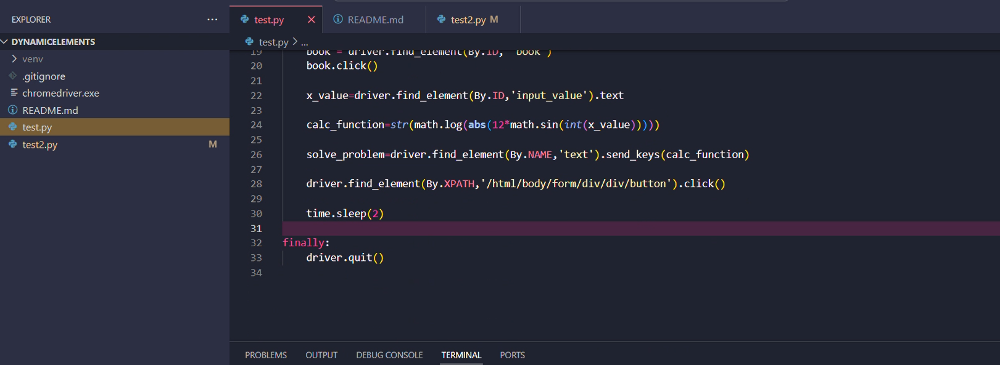

# dynamicElements

The code in `test.py` waits about 12 sec to book the hotel at price $100 and solve the capture.
The code in `test2.py` fills 2 different registration forms. The first one passes the test and the second fails it.
## Video
